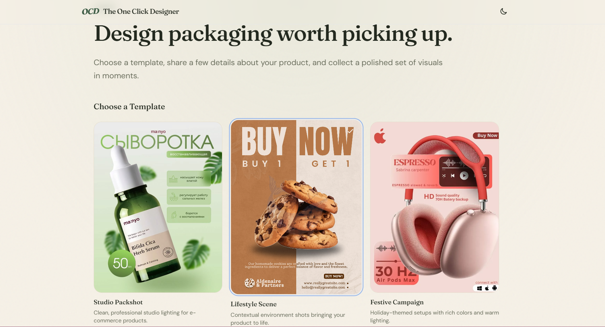

# OneClickDesigner — Unstitched Task

This is my submission for the Full Stack Engineering Intern take-home assignment. It's a mini "Generation Studio" where users can pick a design template, fill out a dynamic form (driven entirely by a backend schema), and watch a simulated 25-second generation process that yields a gallery of product mockups.



## How to run it locally

The project is structured as a simple monorepo containing both the React frontend (Vite) and the Express backend.

1. **Install dependencies**
   From the root directory, install everything:
   ```bash
   npm install
   ```

2. **Environment variables**
   There are `.env.example` files in both the `client/` and `server/` directories. Copy them to create `.env` files in their respective folders. 
   - Server defaults to port 3000.
   - Client expects the API at `http://localhost:3000`.

3. **Start the app**
   Run the dev script from the root to start both the client and server concurrently:
   ```bash
   npm run dev
   ```
   The frontend will be available at `http://localhost:5173`.

## Three decisions I made and why

1. **Chained timeouts for polling instead of `setInterval`**  
   For the job runner (Task 3), I used a recursive `setTimeout` pattern rather than a standard interval. This guarantees that requests never stack up if the server or network is slow to respond. I also added an event listener for `visibilitychange` so the app pauses polling if the user switches to another tab, which saves network and server resources.

2. **Calculating job state on the fly**  
   On the backend, instead of running background timers or workers to constantly update the status of each job in memory, the `getJob` endpoint calculates the current state (queued, processing, stages, complete) dynamically based on the time elapsed since the job was created. This approach avoids background memory leaks and keeps the server logic incredibly simple and robust.

3. **Client-side image resizing via Canvas**  
   To fulfill the requirement of resizing images to a maximum edge of 2048px before upload, I implemented a utility using `createImageBitmap` and an off-screen canvas. Doing this on the client side drastically reduces the payload size being sent to the server and avoids choking the Node event loop with heavy image processing.


## One thing I would do differently with more time

If I had more time, I would move away from the in-memory `Map` storage and implement a real database (like PostgreSQL or MongoDB) to persist jobs across server restarts. Along with that, instead of passing image payloads directly through the Express server, I would set up pre-signed URLs so the client could upload images directly to a cloud storage bucket (like AWS S3).

## Time taken

Roughly 9-10 hours. I spent a good chunk of that time focusing heavily on getting the edge cases right (like the optimistic UI rollbacks for the "like" button and ensuring the form renders dynamically based on the schema order and groups).
